</img>


<center style="font-size:50px"><strong>华中科技大学</strong></center>


<center style="font-size:40px"><strong>多媒体技术实验报告</strong></center>


<center style="font-size:20px"><strong>班级：<u>电信提高1901班</u></strong></center>

<center style="font-size:20px"><strong>姓名：  <u>&nbsp;&nbsp;&nbsp;&nbsp;&nbsp;&nbsp;&nbsp;&nbsp;许逸飞&nbsp;&nbsp;&nbsp;&nbsp;&nbsp;&nbsp;&nbsp;&nbsp;</u></strong></center>

<center style="font-size:20px"><strong>学号：  <u>&nbsp;U201915709&nbsp;&nbsp;&nbsp;&nbsp;</u></strong></center>

<center style="font-size:20px"><strong>日期：<u>&nbsp;&nbsp;&nbsp;&nbsp;&nbsp;&nbsp;&nbsp;2022.6&nbsp;&nbsp;&nbsp;&nbsp;&nbsp;&nbsp;&nbsp;&nbsp;&nbsp;&nbsp;</u></strong></center>


## 实验一：实现运动估计、补偿算法

### 一、实验目的

了解常见的视频编码中的运动估计与运动补偿算法，通过代码实现算法加强对视频编码的理解。

### 二、实验内容

#### 实现运动估计

1. **实现利用全搜索、三步搜索法计算运动矢量，并画出运动矢量图（可参考`quiver()`函数）**

2. **匹配准则：SAD（绝对误差和）；块大小：8\*8, 搜索范围：[-w, w]，其中w为正整数**

   比较w取不同整数数值时的计算复杂度（取三个不同的w，并计算搜索次数、运行时间）

#### 实现运动补偿

1. **利用运动矢量，实现运动补偿，并画出残差图像**

### 三、实验原理

**运动估计：**

在帧间预测编码中，由于活动图像邻近帧中的景物存在着一定的相关性。因此，可将活动图像分成若干块或宏块，并设法搜索出每个块或宏块在邻近帧图像中的位置，并得出两者之间的空间位置的相对偏移量，得到的相对偏移量就是通常所指的运动矢量，得到运动矢量的过程被称为运动估计。

运动矢量和经过运动匹配后得到的预测误差共同发送到解码端，在解码端按照运动矢量指明的位置，从已经解码的邻近参考帧图像中找到相应的块或宏块，和预测误差相加后就得到了块或宏块在当前帧中的位置。

通过运动估计可以去除帧间冗余度，使得视频传输的比特数大为减少，因此，运动估计是视频压缩处理系统中的一个重要组成部分。

**运动补偿：**

运动补偿是一种描述相邻帧（相邻在这里表示在编码关系上相邻，在播放顺序上两帧未必相邻）差别的方法，具体来说是描述前面一帧的每个小块怎样移动到当前帧中的某个位置去。这种方法经常被视频压缩/视频编解码器用来减少视频序列中的空域冗余。它也可以用来进行去交织（deinterlacing）与以及运动插值（motion interpolation）的操作。

### 四、实验代码实现

#### 1. 实验环境

- **硬件环境：**

  CPU：11th Gen Intel(R) Core(TM) i5-11300H @ 3.10GHz 
  内存：16GB
  操作系统：Windows10

- **软件环境：**

  编程环境：matlabR2021a 64bit(Win64)

#### 2. 算法流程

1. 读入参考帧图像和当前帧图像，并转换为灰度图
2. 进行搜索算法，确定每个宏块的运动矢量
3. 根据运动矢量绘制运动矢量图
4. 根据运动矢量计算预测帧图像，并且输出残差图像

#### 3. 算法实现

1. **SAD：**

   ```matlab
   function cost = SAD(cur_block,ref_block)
       cost=sum(sum(abs(cur_block-ref_block))); 
   end
   ```

2. **全搜索算法：**

   大体思路为对于每一个宏块，根据其中心点位置，搜索以其为中心向外扩展w范围空间的各个位置，计算这些位置的SAD，选出最小的一个，根据其索引计算得到运动矢量。

   ```matlab
   function [motion_vector,block_center,costs] = FullSearch(cur_img, ref_img, marco_blcok_size, w)
       
       %% 定义基本变量
       % search_times 记录搜索次数
       search_times = 0;
       [row, col] = size(cur_img);
       % 定义每个宏块中心点位置
       block_center = zeros(2, row*col/(marco_blcok_size^2)); 
       % 定义每个宏块运动矢量
       motion_vector = zeros(2,row*col/(marco_blcok_size^2)); 
       
       % 记录当前处理的宏块的下标
       macro_block_index = 1;
       fprintf("====================================================================\n");
       fprintf("全范围搜索:\n");
       profile on  % 开启 profile
       
       %% 全搜索核心算法
       % 当前帧起始行搜索范围，步长是块数 
       for i = 1:marco_blcok_size:row-marco_blcok_size+1     
           % 当前帧起始列搜索范围，步长是块数
           for j = 1:marco_blcok_size:col-marco_blcok_size+1
               % costs为临时变量，存储针对每个宏块的各个位置的SAD
               costs = ones(2*w+1,2*w+1)*100000;
               for m = -w: w
                   for n = -w: w
                       ref_blockk_row = i+m; %参考帧搜索框起始行
                       ref_block_col = j+n; %参考帧搜索框起始列
                       % 如果超出了搜索范围，就直接退出
                       if (ref_blockk_row<1||ref_blockk_row+marco_blcok_size-1>row||ref_block_col<1||ref_block_col+marco_blcok_size-1>col)                     
                           continue;                                                            
                       end
                       search_times = search_times + 1;
                       % 计算SAD
                       costs(m+w+1,n+w+1) =...
                           costSAD(cur_img(i:i+marco_blcok_size-1,j:j+marco_blcok_size-1),ref_img(ref_blockk_row:ref_blockk_row+marco_blcok_size-1,ref_block_col:ref_block_col+marco_blcok_size-1));
                   end
               end
               % 更新宏块的运动向量的记录
               block_center(1,macro_block_index) = i+ marco_blcok_size/2-1;                 
               block_center(2,macro_block_index) = j+ marco_blcok_size/2-1;
            
               [min_x_index,min_y_index,~]=minCost(costs); 
               
               motion_vector(1,macro_block_index) = min_x_index-w-1; 
               motion_vector(2,macro_block_index) = min_y_index-w-1; 
               macro_block_index = macro_block_index+1;
            end
       end 
       %% 后处理，打印信息，记录profile运行结果
       % 查看profile结果
       profile viewer  
       p = profile('info');
       % 保存profile 结果
       profsave(p,'profile_results') 
       fprintf("共搜索了%d次\n", search_times);
       fprintf("====================================================================\n");
   end
   ```

3. **三步搜索算法：**

   大体思路为对于每一个宏块，根据其中心点位置，搜索以其为中心向外扩展的9格的各个位置（包括原点位置），计算这些位置的SAD，选出最小的一个，根据其索引计算得到运动矢量。

   在三步搜索法中并不需要定义一个`costs`数组存储SAD，因为每次的遍历只有9个点需要处理，每次保存最小的位置即可，不需要额外空间存储也可以使处理很简单。

   ```matlab
   function [motion_vector,block_center] = BinarySearch(cur_img, ref_img, macro_block_size, dm)
       %% 定义基本变量
       % search_times 记录搜索次数
       search_times = 0;
       [row, col] = size(cur_img);
       % 定义每个宏块中心点位置
       block_center = zeros(2, row*col/(macro_block_size^2)); 
       % 定义每个宏块运动矢量
       motion_vector = zeros(2,row*col/(macro_block_size^2)); 
       % 记录当前处理的宏块的下标
       macro_block_index= 1;
       % 设置初始步长
       step = dm; 
       fprintf("====================================================================\n");
       fprintf("三步搜索法:\n");
       % 开启 profile
       profile on 
       
       %% 三步搜索法实现
       %当前帧起始行搜索范围，步长是块数 
       for i = 1:macro_block_size:row-macro_block_size+1     
           for j = 1:macro_block_size:col-macro_block_size+1 %当前帧起始列搜索范围，步长是块数
               % 每次走step这么长，一层遍历是3次，两层遍历就是9次
               
               start_row = i;
               start_col = j;
               last = 100000;
               min_row = -1;
               min_col = -1;
               % 只要step还大于0就继续循环
               while step > 0
                   %costs = ones(3,3)*100000;
                   for m= -step: step: step
                       for n= -step: step: step
                           ref_block_row = start_row+m; %参考帧搜索框起始行
                           ref_block_col = start_col+n; %参考帧搜索框起始列
                           search_times = search_times + 1;
                           % 如果超出搜索范围直接退出
                           if (ref_block_row < 1|| ref_block_row+macro_block_size-1 > row || ref_block_col < 1 || ref_block_col+macro_block_size-1 > col)                     
                               continue;                                                            
                           end
                           %计算SAD
                           cost = costSAD(cur_img(i:i+macro_block_size-1,j:j+macro_block_size-1),ref_img(ref_block_row:ref_block_row+macro_block_size-1,ref_block_col:ref_block_col+macro_block_size-1));
                           if(last > cost)
                               last = cost;
                               min_row = ref_block_row;
                               min_col = ref_block_col;
                           end
                       end
                   end
                   % 每次9个点搜索结束后步长减半
         
                   if step > 1
                       start_row = min_row;
                       start_col = min_col; 
                   end
                   step = floor(step / 2);
               end
               % 恢复初始步长
               step = dm;
               
               block_center(1,macro_block_index) = i+ macro_block_size/2-1;               
               block_center(2,macro_block_index) = j+ macro_block_size/2-1;
               
               motion_vector(1,macro_block_index) = min_row-i;
               motion_vector(2,macro_block_index) = min_col-j; 
               macro_block_index = macro_block_index+1;
            end
       end
       %% 后处理，打印信息，记录profile运行结果
       % 查看profile结果
       profile viewer  
       p = profile('info');
       % 保存profile 结果
       profsave(p,'profile_results') 
       % 打印搜索次数
       fprintf("共搜索了%d次\n", search_times);
       fprintf("====================================================================\n");
   end
   ```

4. **绘制运动矢量图：**

   调用matlab中提供的`quiver()`函数，指定由 `X` 和 `Y` 指定的笛卡尔坐标上绘制具有定向分量 `U` 和 `V` 的箭头

5. **运动补偿计算预测帧并输出残差：**

   利用参考帧、输出的运动矢量，并且给定计算过程中的宏块大小即可进行预测帧的构建

   ```matlab
   function pred_img = motion_compensation(ref_img, motion_vector, macro_block_size)
       [row,col] = size(ref_img);
       macro_block_index = 1;
       for i = 1:macro_block_size:row-macro_block_size+1                
           for j = 1:macro_block_size:col-macro_block_size+1 
                pred_img(i:i+macro_block_size-1,j:j+macro_block_size-1) = ref_img(i+motion_vector(1,macro_block_index):i+motion_vector(1,macro_block_index)+macro_block_size-1, ...
                    j+motion_vector(2,macro_block_index):j+motion_vector(2,macro_block_index)+macro_block_size-1);   
                macro_block_index = macro_block_index+1;
           end
       end
   end
   ```

#### 4. 其他细节

搜索次数、运行时间等结果分别使用`fprintf()`函数进行打印以及使用`profile`来可视化处理

### 五、实验效果

#### 运动矢量与残差图：

**以下为宏块大小 = 8，w = 7的效果图：**

1. **全搜索：**

   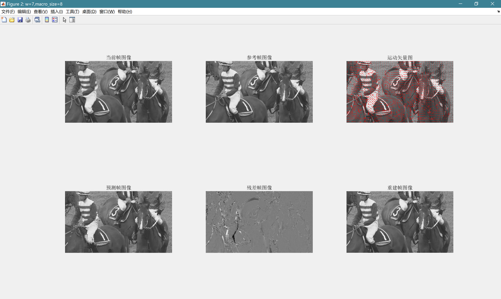

2. **三步法搜索：**

   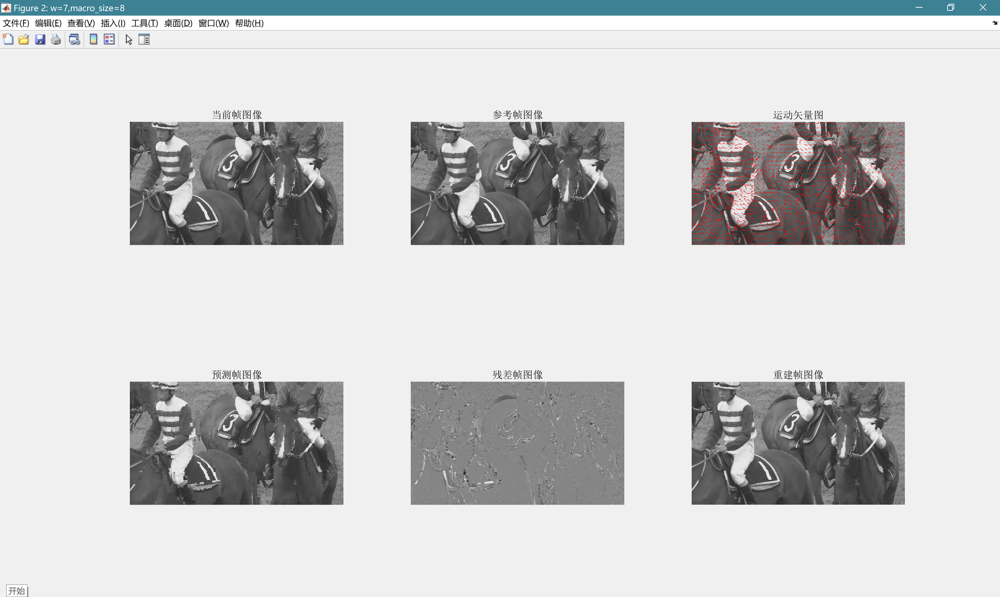

#### 两种搜索方式的运行时间对比（仍然为宏块=8，w=7）

1. **全范围搜索：**

   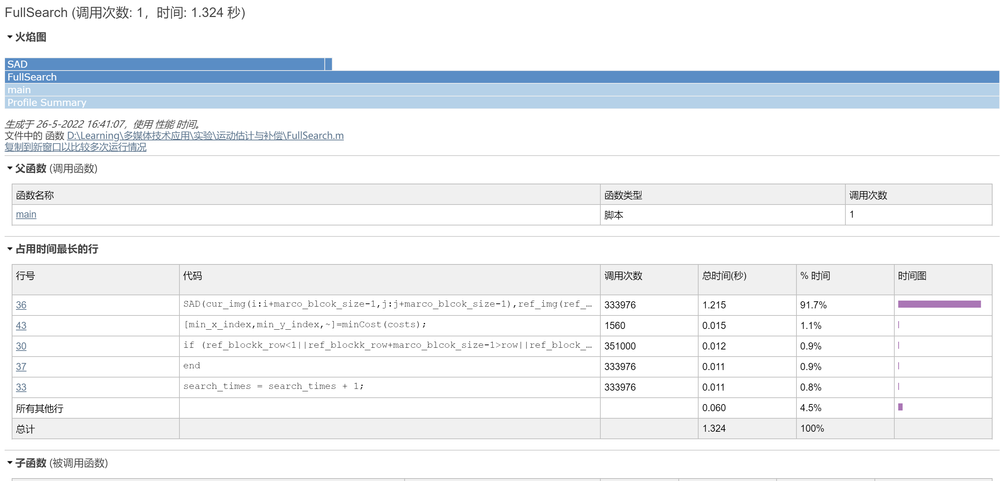

   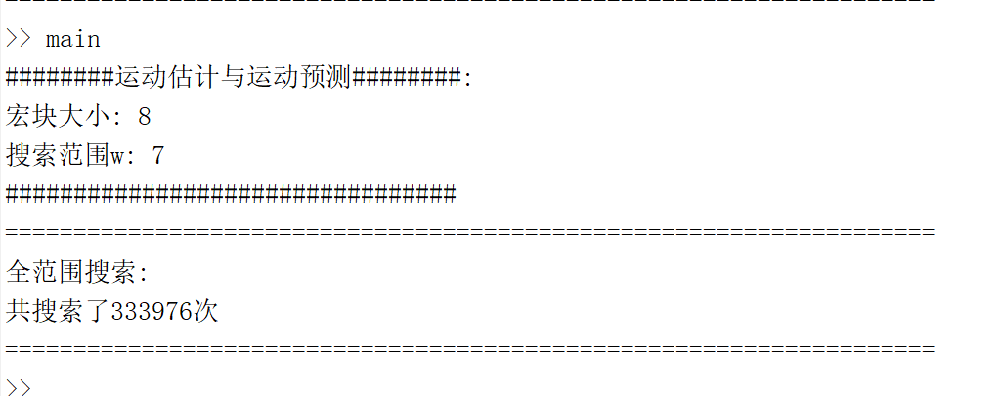

2. **三步法搜索：**

   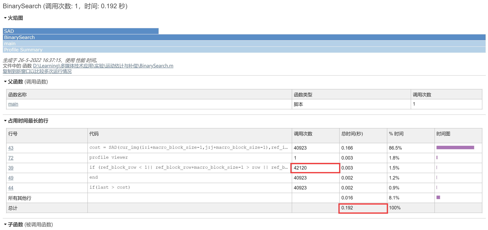

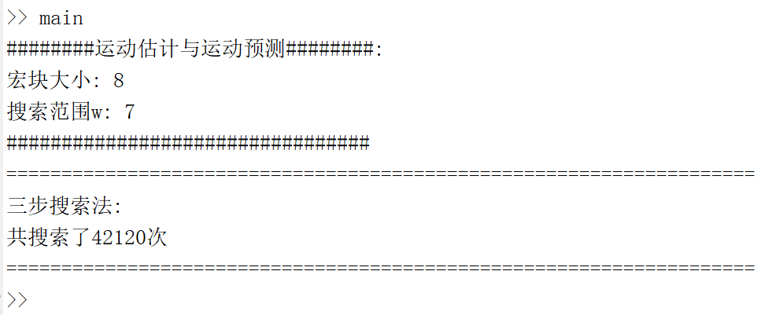

**通过对比如上两种搜索方式可以得出，使用三步法搜索的方式能大幅度提高搜索速度，搜索次数也大幅减少。可以说是远小于全搜索方式。但区别时三步法进行搜索是一种贪心策略，并不总能找到全局最优，但以这样的效率优化换取一定质量的牺牲是可以接受的。**

#### 不同w情况下的运行时间对比（以全范围搜索为例）

1. w = 7

   

   

2. w = 5

   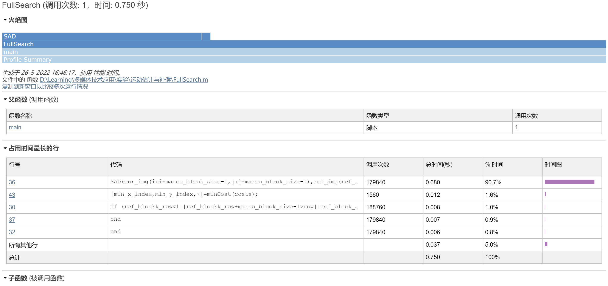

   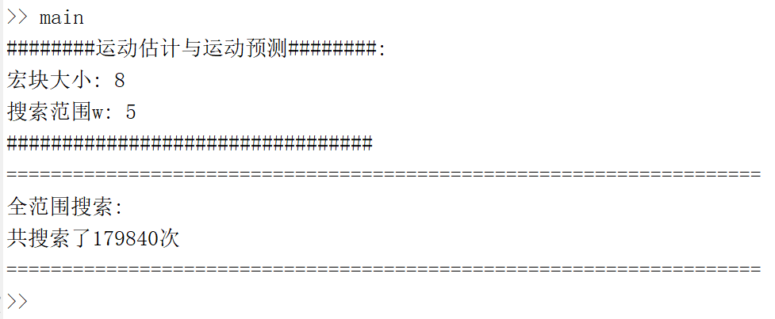

3. w = 9

   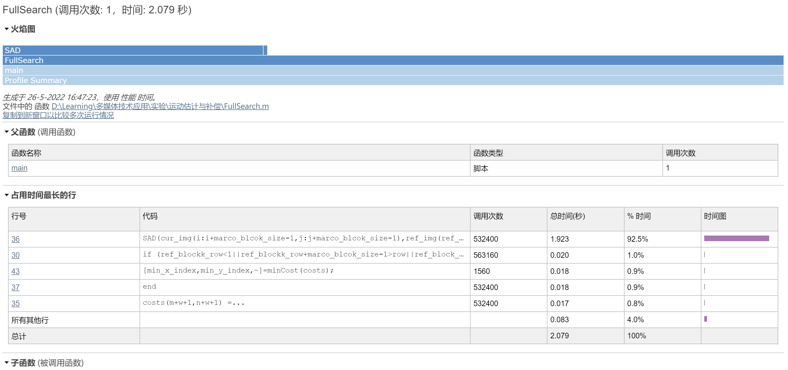

   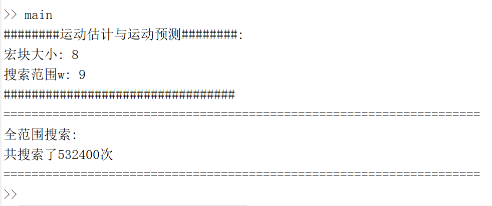

   通过以上对比，可以看出当w有变化时，搜索的范围有明显的增减变化，甚至有一倍的变化量，但大致仍处于同一数量级下。

### 六、结论与思考

此次实验，让我进一步地了解了视频编码中的运动估计和运动补偿的思想，对算法有了更加清晰的认识。通过对比两种搜索方式得到的实验结果可以得出以下结论：

- 三步搜索法得到的运动矢量并不是全局最优的，而全搜索法会找到最为匹配的宏块
- w的大小会影响预测的质量，w越大效果越好，但同时耗时越长
- 三步搜索法的运行速度远低于全搜索法，实际应用时应避免使用全搜索。


## 实验二：基于socket的视频传输

**该部分代码可以前往[github仓库](https://github.com/XuYi-fei/VideoTransmission)查看**

### 一、实验目的

1. 熟悉编程中常见的socket套接字使用
2. 对yuv算法进行进一步了解并了解yuv文件的存储格式
3. 加深对多线程的理解

### 二、实验内容

搭建服务端和客户端，可以互相通信，实现视频传输

 **要求：**

1. 编码后的单个视频（YUV420格式）的视频片段存储在服务端

2. 通过socket建立连接，客户端向服务端请求视频，服务端发送相应的码流文件

3. 客户端接收存放码流文件，实时解码并播放
4. 调用解码器指令
5. 播放时将YUV420格式转为RGB
6. 实现播放器功能，并可以控制播放速度（即调整帧率）
7. 边接收边播放，需要用到多线程

### 三、实验原理

#### **socket：**

socket，又称套接字，应用程序通常通过"套接字"向网络发出请求或者应答网络请求，使主机间或者一台计算机上的进程间可以通讯。

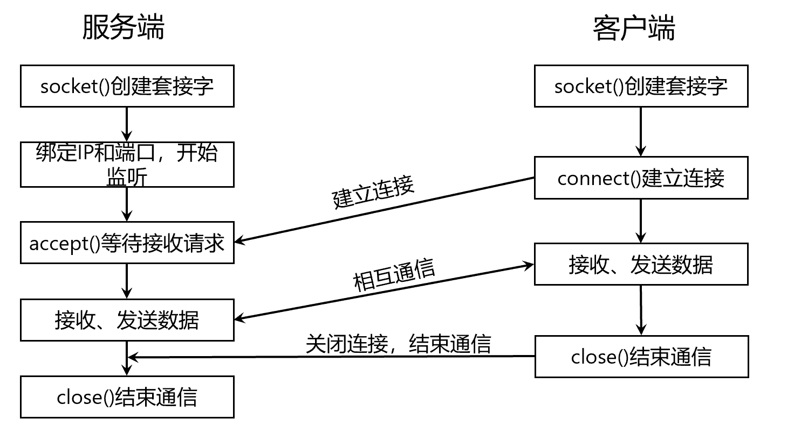

#### **YUV格式：**

YUV是一种颜色空间，基于YUV的颜色编码是流媒体的常用编码方式。YUV是编译true-color颜色空间（color space）的种类，Y’UV, YUV, YCbCr，YPbPr等专有名词都可以称为YUV，彼此有重叠。“Y”表示明亮度（Luminance、Luma），“U”和“V”则是色度（Chrominance、Chroma），Y′UV, YUV, YCbCr, YPbPr所指涉的范围，常有混淆或重叠的情况。
为节省带宽起见，大多数YUV格式平均使用的每像素位数都少于24位。主要的抽样（subsample，一般对色度分量进行抽样）格式有YCbCr 4:2:0、YCbCr 4:2:2、YCbCr 4:1:1和YCbCr 4:4:4。YUV的表示法称为A:B:C表示法，各种格式表示如下：

- 4:4:4 表示完全取样，每一个Y对应一组UV分量；
- 4:2:2 表示2:1的水平取样，垂直完全采样，每两个Y共用一组UV分量；
- 4:2:0 表示2:1的水平取样，垂直2:1采样，两个Y用一个U分量，两个Y用一个V分量；（4个Y共用一组UV分量）
- 4:1:1 表示4:1的水平取样，垂直完全采样，每四个Y共用一组UV分量；

**实验中数据为<u>4:2:0</u>的抽样格式**

### 四、实验代码实现

#### 1. 实验环境

- **硬件环境：**

  CPU：11th Gen Intel(R) Core(TM) i5-11300H @ 3.10GHz 
  内存：16GB
  操作系统：Windows10

- **软件环境：**

  编程环境：python3.8

  第三方库：`loguru`、`numpy`、`opencv-python`

  集成开发环境：pycharm专业版
  
  服务器环境：CentOS Linux release 7.9.2009 (Core)

#### 2. 算法流程

##### 服务端：

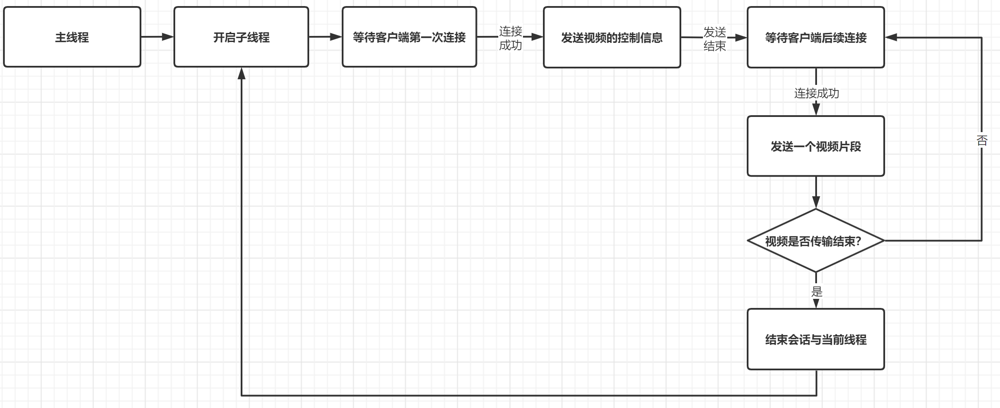

##### 客户端：

客户端的执行流程略有复杂，具体如下：

- 相关名词定义

  - 定义了两个共享变量：

    - 优先队列（记作$q$）
    - 互斥字典（记作$dict$）

    这两个变量类型均为自定义数据结构，对其进行了互斥访问的封装

  - 定义了三种线程：
    - 用于网络传输，和服务端通信并将其解码为yuv文件的线程（记作$socket\_thread$）
    - 用于解码yuv文件并将其解码为rgb数据的线程（记作$decode\_thread$）
    - 用于播放已经被解码为rgb数据的线程（记作$display\_thread$）
  - 定义了两个线程锁用于保证对优先队列$q$和互斥字典$dict$的访问
  - 定义了一个条件变量用于协调$socket\_thread$和$decode\_thread$的执行顺序

- 具体流程：

  1. 首先主线程开启，主线程会创建一个$socket\_thread$线程、一个$decode\_thread$线程、一个$display\_thread$线程
  2. $socket\_thread$线程向服务端发起连接请求，完成第一次请求，获取到视频的相关控制信息，并且根据控制信息初始化$decode\_thread$的相关设置
  3. 接着线程开始各自运行：
     - $socket\_thread$：不断向服务器发起请求获取视频数据，每个视频片段（实验中对应实际上是一个bin文件）对应一次socket通信，当获取到视频数据后调用解码器`TAppDecode.exe`将其转换为yuv文件，然后互斥访问优先队列$q$，将此时收到的视频片段序号和对应的yuv数据存储到$q$中。同时唤醒被阻塞的$decode\_thread$线程
     - $decode\_thread$：初始被阻塞，当被唤醒时互斥访问$q$，从中取出一个yuv文件，进行解码，当解码完成后，互斥访问$dict$，将解码的rgb数据及每帧的播放序号放入$dict$(key为序号，val为播放帧)中
     - $display\_thread$：循环访问$dict$的`get()`方法，如果获得的数据为空证明没有新的可播放帧，保持播放上一帧图片，并且附上提示文字说明当前正在缓冲（如果第一帧也尚未到达那么上一帧图片为全黑图片）；如果获得的数据不为空证明有新的可播放帧，将新的图片显示，并根据用户初始配置延时指定时间。延时显示后调用$dict$的`if_end()`方法判断是否此次视频播放全部结束，如果是那么退出循环，停留在最后一帧；如果未结束那么继续循环。

- 流程图如下：

  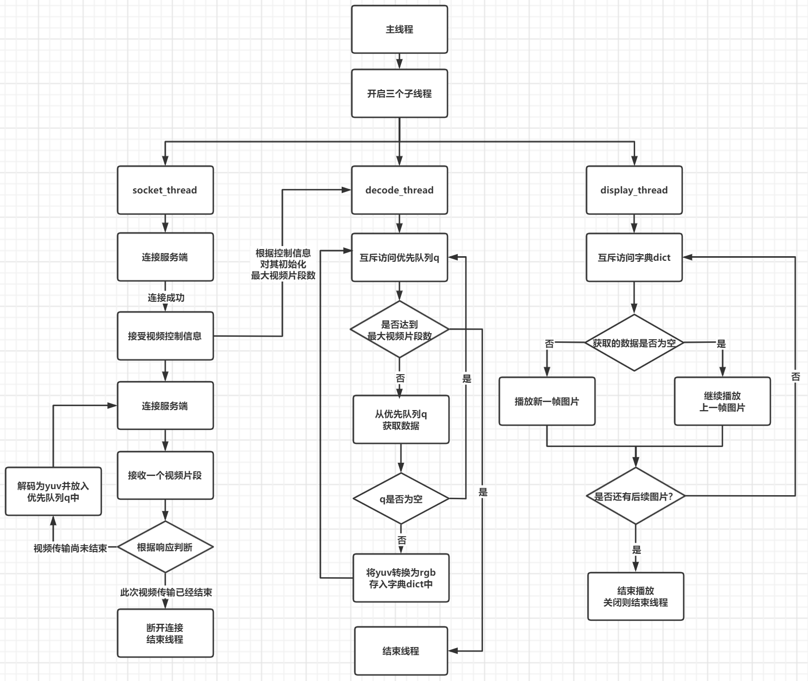

#### 3. 算法实现

**如下代码中部分被封装的函数不再列出且删除了所有的日志打印，完整可见随附源码或前往[github仓库](https://github.com/XuYi-fei/VideoTransmission)查看**

- **共享的优先队列：**

  ```python
  class DataQueue:
      def __init__(self, size=10):
          """
          :param size: 此次视频传输的视频段数量 
          """
          self.size = size
          self.queue = queue.PriorityQueue(maxsize=self.size)
          self.current_size = 0
          self.lock = threading.Lock()
  
      def full(self):
          return self.current_size >= self.size
  
      def put(self, seq, data):
          """
          :param seq: 放入队列的数据优先级，越小优先级越高
          :param data: 放入队列的数据
          :return:
          """
          self.lock.acquire()
          self.queue.put((seq, data))
          self.lock.release()
          self.current_size += 1
  
      def get(self):
          """
          :return: 如果当前的队列大小小于1，返回空，否则返回数据
          """
          if self.current_size <= 0:
              return None, None
          self.lock.acquire()
          item = self.queue.get()
          self.lock.release()
          self.current_size -= 1
          return item
  ```

- **共享的字典：**

  ```python
  class FrameDict(object):
  
      def __init__(self):
          # 按顺序下一个希望收到的帧
          self.next_index = 1
          # 下一个将要播放的帧
          self.get_index = 1
          self.lock = threading.Lock()
          self._ab = 1
          self.frame = {}
          self.end = False
  
      def __len__(self):
          return len(self.frame)
  
      def data_end(self):
          self.end = True
  
      def if_end(self) -> bool:
          """
          :return: 判断是否播放结束
          """
          return self.end and self.get_index >= self.next_index
  
      def put(self, seq, data):
          """
          :param seq: 放入字典的key，代表帧序号
          :param data: 放入字典的帧
          :return:
          """
          self.lock.acquire()
          # 不管收到的数据是否是下一个希望收到的帧，都要把它先存下来，类似计网中的滑动窗口
          self.frame[seq] = data
          while True:
              # 更新next_index
              if self.next_index in self.frame:
                  self.next_index += 1
              else:
                  break
          self.lock.release()
  
      def get(self):
          if self.get_index >= self.next_index:
              return None
          self.lock.acquire()
          # 取出下一个播放帧并更新响应属性
          item = self.frame[self.get_index]
          del self.frame[self.get_index]
          self.get_index += 1
          self.lock.release()
          return item
  ```

- **socket_thread实现：**

  ```python
  class SocketService(Thread):
      def __init__(self, config: DefaultConfig):
          """
          :param config: 配置变量
          """
          super(SocketService, self).__init__()
          # 获取需要的配置
          self.client_config = config.client_config
          self.data_config = config.data_received_config
          self.server_config = config.server_config
          self.absolute_path = os.getcwd()
          self.saved_dir, self.output_dir, self.exe_path = self.get_paths()
          create_folder(self.saved_dir, self.output_dir)
  
      def get_paths(self):
          """
          :return: 获得三个拼接路径——bin文件存储路径、yuv存储路径、解码exe路径
          """
          return os.path.join(self.absolute_path, self.data_config.data_saved_path), \
                 os.path.join(self.absolute_path, self.data_config.data_output_path), \
                 os.path.join(self.absolute_path, self.data_config.data_decode_exe_path)
  
      def get_cmd(self, seq: str) -> str:
          """
          :param seq: 当前文件的序号
          :return: 生成的命令行命令
          """
          return self.exe_path + " -b " + os.path.join(self.saved_dir, seq + '.bin') + " -o " + \
                 os.path.join(self.output_dir, seq + '.yuv')
  
      def run(self):
          global con
          while True:
              self.sk = socket.socket(socket.AF_INET, socket.SOCK_STREAM)
              self.sk.connect((self.server_config.ip, self.server_config.port))
              res = str(self.sk.recv(2048).decode(encoding='utf-8'))
              if res == "connected!":
                  send_msg_no_recv(self.sk, "ok")
              data, num = bytes(), 0
              # 获取控制信息
              info = self.sk.recv(1024).decode(encoding='utf-8')
              if info == "All of the data is sent!":
                  send_msg_no_recv(self.sk, "ok")
                  frame_dict.data_end()
                  self.sk.close()
                  break
              info = eval(info)
              send_msg_no_recv(self.sk, "ok")
              # 接受视频段
              while num <= int(info['length']):
                  data += self.sk.recv(4096)
                  num += 4096
                  send_msg_no_recv(self.sk, "ok")
              # 保存为bin文件
              with open(os.path.join(self.saved_dir, str(info['seq']) + '.bin'), 'wb') as f:
                  f.write(data)
              # 解码为yuv文件
              command = self.get_cmd(str(info['seq']))
              p = subprocess.Popen(command, shell=True, stdout=subprocess.PIPE)
              p.communicate()
              # 互斥访问队列
              con.acquire()
              data_queue.put(info['seq'], os.path.join(self.output_dir, str(info['seq']) + '.yuv'))
              # 唤醒被阻塞的线程
              con.notify_all()
              con.release()
  ```

- **decode_thread实现：**

  ```python
  class DataManagement(Thread):
      def __init__(self, size):
          """
          :param size: 此次视频传输的视频段数量
          """
          super(DataManagement, self).__init__()
          self.config = Config.data_received_config
          self.max_received_num = size
  
      def run(self) -> None:
          global if_trans_finished
          global received_num
          global con
          while True:
              con.acquire()
              seq, data = data_queue.get()
              if received_num >= self.max_received_num:
                  con.release()
                  break
              if data is None:
                  con.wait()
                  con.release()
                  continue
              received_num += 1
              con.release()
              self.yuv2bgr(seq, data)
  
      def from_I420(self, yuv_data, frames):
          """
          从yuv文件中解析得到Y、U、V分量
          :param yuv_data:
          :param frames:
          :return: Y、U、V分量
          """
          Y = np.zeros((frames, self.config.data_frame_height, self.config.data_frame_width), dtype=np.uint8)
          U = np.zeros((frames, int(self.config.data_frame_height / 2), int(self.config.data_frame_width / 2)), dtype=np.uint8)
          V = np.zeros((frames, int(self.config.data_frame_height / 2), int(self.config.data_frame_width / 2)), dtype=np.uint8)
  
          for frame_idx in range(0, frames):
              y_start = frame_idx * self.config.video_image_size
              u_start = y_start + self.config.data_frame_height * self.config.data_frame_width
              v_start = u_start + int(self.config.data_frame_height * self.config.data_frame_width / 4)
              v_end = v_start + int(self.config.data_frame_height * self.config.data_frame_width / 4)
  
              Y[frame_idx, :, :] = yuv_data[y_start: u_start].reshape(
                  (self.config.data_frame_height, self.config.data_frame_width))
              U[frame_idx, :, :] = yuv_data[u_start: v_start].reshape(
                  (int(self.config.data_frame_height / 2), int(self.config.data_frame_width / 2)))
              V[frame_idx, :, :] = yuv_data[v_start: v_end].reshape(
                  (int(self.config.data_frame_height / 2), int(self.config.data_frame_width / 2)))
          return Y, U, V
  
      def yuv2bgr(self, seq, file_name):
          """
          将读入的yuv数据转化为bgr的img存入列表
          :param seq: yuv文件序号
          :param file_name: yuv文件路径
          :return: None
          """
          imgs = []
          with open(file_name, 'rb') as f:
              data = np.frombuffer(f.read(), np.uint8)
          Y, U, V = self.from_I420(data, self.config.data_frame_per_yuv)
          for frame_idx in range(self.config.data_frame_per_yuv):
              bgr_data = YUV2RGB(Y[frame_idx, :, :], U[frame_idx, :, :], V[frame_idx, :, :], self.config.data_frame_height, self.config.data_frame_width)           # numpy
              if bgr_data is not None:
                  imgs.append(bgr_data)
          # 放入字典中
          for i, img in enumerate(imgs):
              frame_dict.put((seq - 1) * self.config.data_frame_per_yuv + i + 1, img)
  ```

- **display_thread实现：**

  ```python
  class SlidingWindow(Thread):
      def __init__(self, frame_dict: FrameDict, config):
          """
          :param frame_dict: 保存帧数据的字典 
          :param config: 配置信息
          """
          super(SlidingWindow, self).__init__()
          self.video_config = config
          self.frame_dict = frame_dict
          self.current_seq = 0
  
      def run(self) -> None:
          img = np.zeros((self.video_config.video_height, self.video_config.video_width, 3))
          while True:
              # 获取新的一帧
              new_img = self.frame_dict.get()
              text = "" if new_img is not None else "buffering...."
              img = new_img if new_img is not None else img
              cv2.putText(img, text,
                          (self.video_config.video_height // 5, self.video_config.video_width // 2),
                          cv2.FONT_HERSHEY_SIMPLEX, 1, (255, 255, 255), 1)
              # 显示帧
              cv2.imshow("video", img)
              # 延时
              cv2.waitKey(self.video_config.video_image_stop)
              if self.frame_dict.if_end():
                  break
          cv2.waitKey()
  ```

- **客户端主线程：**

  ```python
  def main():
      global frame_dict
      display_thread = SlidingWindow(frame_dict, Config.video_config)
      display_thread.start()
      # 先建立连接，确定接受的数据有多少个文件
      sk = socket.socket()
      sk.connect((Config.server_config.ip, Config.server_config.port))
      res = str(sk.recv(2048).decode(encoding='utf-8'))
      sk.close()
      # 开启DataManagement线程，监听优先队列内的数据
      decode_thread = DataManagement(int(res))
      decode_thread.start()
      # 开启网络传输线程
      socket_thread = SocketService(Config)
      socket_thread.start()
      socket_thread.join()
      # 标志传输结束
      decode_thread.join()
      display_thread.join()
      clean_up()
  ```

- **服务端主线程：**

  ```python
  class SocketService:
      def __init__(self, config: DefaultConfig, bin_files, size):
          """
          :param config: 全局配置
          :param bin_files: 一个所读入的二进制文件的生成器
          :param size: 确定下来的二进制文件个数
          """
          self.bin_files = bin_files
          self.client_config = config.client_config
          self.server_config = config.server_config
          # 初始化socket属性
          self.sk = socket.socket(socket.AF_INET, socket.SOCK_STREAM)
          self.sk.setsockopt(socket.SOL_SOCKET, socket.SO_REUSEADDR, 1)
          self.sk.bind((self.server_config.ip, self.server_config.port))
          self.sk.listen(10)
          # 编码后的视频文件数目
          self.video_file_size = size
  
      def start(self):
          # seq 标记发送的文件的序号
          seq = 1
          self.client, address = self.sk.accept()
          self.client.sendall(bytes(str(self.video_file_size).encode(encoding='utf-8')))
          self.client.close()
          while True:
              # 等待连接
  
              self.client, address = self.sk.accept()
              # 打印连接的客户机地址
              logger.debug("Ip address of client is [%s]" % address[0])
              # 获取bin数据
              file_data, length = next(self.bin_files)
              info = {"seq": seq, "length": length}
              # 回应客户机连接建立成功
              res = send_msg(self.client, "connected!")
              # 判断当前是否还有码流文件未传输,如果没有了，通知客户端结束
              if not file_data:
                  send_msg(self.client, "All of the data is sent!")
                  break
              # 发送控制信息
              send_msg(self.client, str(info))
              seq += 1
              # 发送文件
              sent_num = 0
              while sent_num < info['length']:
                  send_bytes(self.client, file_data[sent_num:sent_num+4096])
                  sent_num += 4096
          self.sk.close()
  
  def main():
      fileUtils = FilesUtil(os.path.join(os.path.abspath("."), Config.server_config.file_folder_path))
      files = fileUtils.read_data()
      socket_service = SocketService(Config, files, fileUtils.size)
      socket_service.start()
  
  if __name__ == "__main__":
      while True:
          main()
  ```

### 五、实验效果

**将日志级别调为`success`后观察服务端和接收端以及解码如下。如需要完整输出信息可以尝试在`configs.py`中将`LOG_LEVEL`改为`INFO`或`DEBUG`观察更详细的输出（但会影响运行速度及播放流畅度）**

其中：

- `Video transmit begin.`代表客户端与服务端第一次连接成功，接收视频段的控制信息
- `Video transmitted over.`表示此次请求服务端的视频全部获得
- `Connected! Receiving....`表示一个视频片段的传输开始
- `Bitstream received....`表示一个视频片段传输完毕
- `Decoding frame No.xxx`代表$decode\_thread$开始解码一个视频片段，生成可播放的帧图像
- `Decoding No.xxx finished`代表$decode\_thread$解码一个视频片段结束，解码结束得到的数据可以播放
- `Displaying frame No.xxx`表示正在播放第xxx帧，为了不过于影响播放速度，每播放10帧输出一次日志

#### 1. 日志输出：

```
2022-06-08 22:52:12.177 | SUCCESS  | ||###  Video transmit begin.    ###||
2022-06-08 22:52:12.236 | SUCCESS  | ||---  Connected! Receiving.... ---||
2022-06-08 22:52:12.796 | SUCCESS  | ||---  Bitstream received....   ---||
2022-06-08 22:52:13.455 | SUCCESS  | ||###  Decoding frame No.1      ###||
2022-06-08 22:52:13.520 | SUCCESS  | ||---  Connected! Receiving.... ---||
2022-06-08 22:52:14.055 | SUCCESS  | ||---  Bitstream received....   ---||
2022-06-08 22:52:14.524 | SUCCESS  | ||###  Decoding No.1 finished   ###||
2022-06-08 22:52:14.816 | SUCCESS  | ||###  Displaying frame No.10   ###||
2022-06-08 22:52:14.892 | SUCCESS  | ||###  Decoding frame No.2      ###||
2022-06-08 22:52:14.952 | SUCCESS  | ||---  Connected! Receiving.... ---||
2022-06-08 22:52:15.116 | SUCCESS  | ||###  Displaying frame No.20   ###||
2022-06-08 22:52:15.416 | SUCCESS  | ||###  Displaying frame No.30   ###||
2022-06-08 22:52:15.498 | SUCCESS  | ||---  Bitstream received....   ---||
2022-06-08 22:52:15.716 | SUCCESS  | ||###  Displaying frame No.40   ###||
2022-06-08 22:52:15.944 | SUCCESS  | ||###  Decoding No.2 finished   ###||
2022-06-08 22:52:16.016 | SUCCESS  | ||###  Displaying frame No.50   ###||
2022-06-08 22:52:16.209 | SUCCESS  | ||###  Decoding frame No.3      ###||
2022-06-08 22:52:16.272 | SUCCESS  | ||---  Connected! Receiving.... ---||
2022-06-08 22:52:16.316 | SUCCESS  | ||###  Displaying frame No.60   ###||
2022-06-08 22:52:16.616 | SUCCESS  | ||###  Displaying frame No.70   ###||
2022-06-08 22:52:16.875 | SUCCESS  | ||---  Bitstream received....   ---||
2022-06-08 22:52:16.916 | SUCCESS  | ||###  Displaying frame No.80   ###||
2022-06-08 22:52:17.216 | SUCCESS  | ||###  Displaying frame No.90   ###||
2022-06-08 22:52:17.269 | SUCCESS  | ||###  Decoding No.3 finished   ###||
2022-06-08 22:52:17.516 | SUCCESS  | ||###  Displaying frame No.100   ###||
2022-06-08 22:52:17.601 | SUCCESS  | ||###  Decoding frame No.4      ###||
2022-06-08 22:52:17.698 | SUCCESS  | ||---  Connected! Receiving.... ---||
2022-06-08 22:52:17.816 | SUCCESS  | ||###  Displaying frame No.110   ###||
2022-06-08 22:52:18.116 | SUCCESS  | ||###  Displaying frame No.120   ###||
2022-06-08 22:52:18.416 | SUCCESS  | ||###  Displaying frame No.130   ###||
2022-06-08 22:52:18.613 | SUCCESS  | ||###  Decoding No.4 finished   ###||
2022-06-08 22:52:18.656 | SUCCESS  | ||---  Bitstream received....   ---||
2022-06-08 22:52:18.716 | SUCCESS  | ||###  Displaying frame No.140   ###||
2022-06-08 22:52:19.016 | SUCCESS  | ||###  Displaying frame No.150   ###||
2022-06-08 22:52:19.307 | SUCCESS  | ||###  Decoding frame No.5      ###||
2022-06-08 22:52:19.316 | SUCCESS  | ||###  Displaying frame No.160   ###||
2022-06-08 22:52:19.370 | SUCCESS  | ||---  Connected! Receiving.... ---||
2022-06-08 22:52:19.616 | SUCCESS  | ||###  Displaying frame No.170   ###||
2022-06-08 22:52:19.916 | SUCCESS  | ||###  Displaying frame No.180   ###||
2022-06-08 22:52:20.091 | SUCCESS  | ||---  Bitstream received....   ---||
2022-06-08 22:52:20.216 | SUCCESS  | ||###  Displaying frame No.190   ###||
2022-06-08 22:52:20.314 | SUCCESS  | ||###  Decoding No.5 finished   ###||
2022-06-08 22:52:20.516 | SUCCESS  | ||###  Displaying frame No.200   ###||
2022-06-08 22:52:20.804 | SUCCESS  | ||###  Decoding frame No.6      ###||
2022-06-08 22:52:20.816 | SUCCESS  | ||###  Displaying frame No.210   ###||
2022-06-08 22:52:20.866 | SUCCESS  | ||---  Connected! Receiving.... ---||
2022-06-08 22:52:21.116 | SUCCESS  | ||###  Displaying frame No.220   ###||
2022-06-08 22:52:21.419 | SUCCESS  | ||###  Displaying frame No.230   ###||
2022-06-08 22:52:21.518 | SUCCESS  | ||---  Bitstream received....   ---||
2022-06-08 22:52:21.716 | SUCCESS  | ||###  Displaying frame No.240   ###||
2022-06-08 22:52:21.833 | SUCCESS  | ||###  Decoding No.6 finished   ###||
2022-06-08 22:52:22.016 | SUCCESS  | ||###  Displaying frame No.250   ###||
2022-06-08 22:52:22.218 | SUCCESS  | ||###  Decoding frame No.7      ###||
2022-06-08 22:52:22.315 | SUCCESS  | ||---  Connected! Receiving.... ---||
2022-06-08 22:52:22.316 | SUCCESS  | ||###  Displaying frame No.260   ###||
2022-06-08 22:52:22.616 | SUCCESS  | ||###  Displaying frame No.270   ###||
2022-06-08 22:52:22.917 | SUCCESS  | ||###  Displaying frame No.280   ###||
2022-06-08 22:52:23.208 | SUCCESS  | ||###  Decoding No.7 finished   ###||
2022-06-08 22:52:23.216 | SUCCESS  | ||###  Displaying frame No.290   ###||
2022-06-08 22:52:23.346 | SUCCESS  | ||---  Bitstream received....   ---||
2022-06-08 22:52:23.516 | SUCCESS  | ||###  Displaying frame No.300   ###||
2022-06-08 22:52:23.816 | SUCCESS  | ||###  Displaying frame No.310   ###||
2022-06-08 22:52:24.016 | SUCCESS  | ||###  Decoding frame No.8      ###||
2022-06-08 22:52:24.082 | SUCCESS  | ||---  Connected! Receiving.... ---||
2022-06-08 22:52:24.116 | SUCCESS  | ||###  Displaying frame No.320   ###||
2022-06-08 22:52:24.417 | SUCCESS  | ||###  Displaying frame No.330   ###||
2022-06-08 22:52:24.717 | SUCCESS  | ||###  Displaying frame No.340   ###||
2022-06-08 22:52:24.748 | SUCCESS  | ||---  Bitstream received....   ---||
2022-06-08 22:52:25.016 | SUCCESS  | ||###  Displaying frame No.350   ###||
2022-06-08 22:52:25.035 | SUCCESS  | ||###  Decoding No.8 finished   ###||
2022-06-08 22:52:25.316 | SUCCESS  | ||###  Displaying frame No.360   ###||
2022-06-08 22:52:25.445 | SUCCESS  | ||###  Decoding frame No.9      ###||
2022-06-08 22:52:25.510 | SUCCESS  | ||---  Connected! Receiving.... ---||
2022-06-08 22:52:25.617 | SUCCESS  | ||###  Displaying frame No.370   ###||
2022-06-08 22:52:25.916 | SUCCESS  | ||###  Displaying frame No.380   ###||
2022-06-08 22:52:26.111 | SUCCESS  | ||---  Bitstream received....   ---||
2022-06-08 22:52:26.216 | SUCCESS  | ||###  Displaying frame No.390   ###||
2022-06-08 22:52:26.471 | SUCCESS  | ||###  Decoding No.9 finished   ###||
2022-06-08 22:52:26.516 | SUCCESS  | ||###  Displaying frame No.400   ###||
2022-06-08 22:52:26.816 | SUCCESS  | ||###  Displaying frame No.410   ###||
2022-06-08 22:52:26.851 | SUCCESS  | ||###  Decoding frame No.10      ###||
2022-06-08 22:52:26.905 | SUCCESS  | ||###  Video transmitted over.    ###||
2022-06-08 22:52:27.116 | SUCCESS  | ||###  Displaying frame No.420   ###||
2022-06-08 22:52:27.416 | SUCCESS  | ||###  Displaying frame No.430   ###||
2022-06-08 22:52:27.716 | SUCCESS  | ||###  Displaying frame No.440   ###||
2022-06-08 22:52:27.892 | SUCCESS  | ||###  Decoding No.10 finished   ###||
2022-06-08 22:52:28.017 | SUCCESS  | ||###  Displaying frame No.450   ###||
2022-06-08 22:52:28.319 | SUCCESS  | ||###  Displaying frame No.460   ###||
2022-06-08 22:52:28.638 | SUCCESS  | ||###  Displaying frame No.470   ###||
2022-06-08 22:52:28.941 | SUCCESS  | ||###  Displaying frame No.480   ###||
2022-06-08 22:52:29.244 | SUCCESS  | ||###  Displaying frame No.490   ###||
2022-06-08 22:52:29.548 | SUCCESS  | ||###  Displaying frame No.500   ###||
```

由日志的打印可以清楚的看出来三个线程的合作关系，首先需要通信接收到数据然后才能解码并转换，转换后才能进行播放。最终标志着结束的日志输出也是先出现`Video transmitted over.`，然后是解码的结束`Decoding No.10 finished`，最后是`Displaying frame No.xxx`。

#### 2. 视频效果

- 运行时刻的客户端、服务端以及输出的视频：

  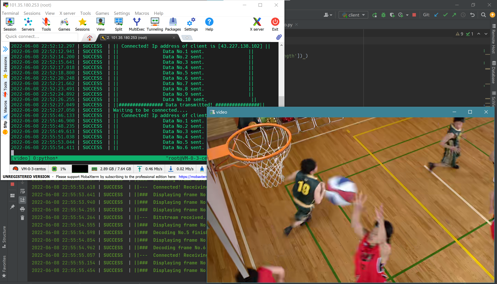

- 最开始运行时，输出视频的黑屏：

  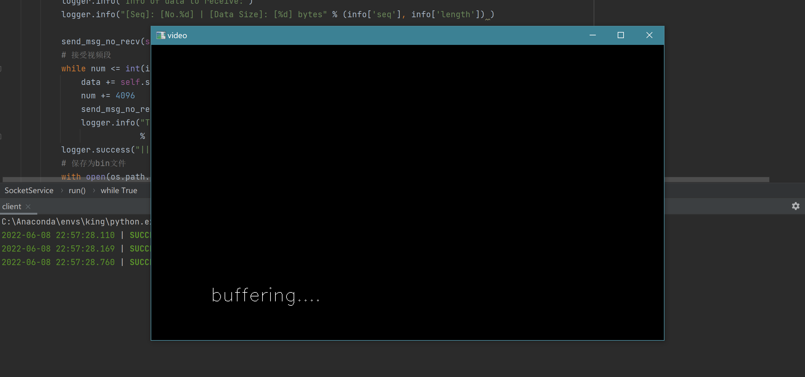

  此时还没有收到服务端的数据或收到后还没有解码到一定程度，于是不能显示画面，以上一帧代替，而此时还没有上一帧于是只能以黑屏替代。

- 网络不好或帧率过高时的缓冲：

  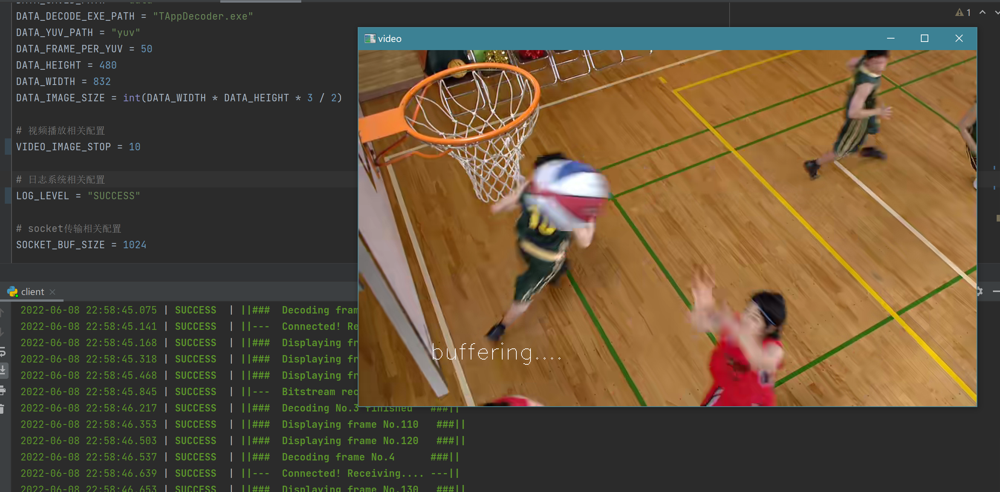

  此时由于网络传输过慢或网络传输速度正常但帧率过高导致解码速度不能与播放速度相匹配，也会出现卡顿情况，但是为了保证观感，显示的是上一帧的图像

### 六、结论与思考

此次实验使用socket搭建了一个十分简易的视频传输模块，在这个操作的过程中对许多之前学习的理论知识进行了验证和实践，对编码算法、视频传输等知识有了更加深刻的理解。

另外在实现代码的过程中遇到了诸多问题：

1. 在实现多线程传输视频时，曾出现了在本地开启服务端时一切正常，但是将其部署到服务器后会出现播放失败的情况，根据报错信息以及日志输出排查，发现是数据报丢失导致解码得到的yuv文件不完整。进一步研究发现这是由于初始算法中在传输一个bin文件时双方并不再互相确认而是一直单向通信，直到服务端发送完毕才互相通信，这导致了数据的丢失。后续改为每传送4KB的信息就互相确认，解决了网络不稳定的问题。
2. 在最开始的时候设置了10个线程进行网络传输，4个线程进行解码，1个线程进行播放。但是效果非常差，经过研究发现是由于python语言自身对多线程的限制导致的。python语言的多线程为用户级线程，并不会分配额外的处理器资源，因此在计算密集的任务中，线程的切换导致的CPU消耗反而大于了多线程切换带来的并发优势，使得整体运行速度更慢。
3. 为了将三个线程的运行速度进行匹配，我将bin文件解码为yuv文件的任务与socket接收文件的任务合为一体，这样的速度平衡会给用户更好的体验。
4. 为了实现共享变量的互斥访问以及线程的同步，使用了条件变量和锁，将操作系统的思想应用到实际很有成就感。

对实验的思考：

1. 实际情况中对于帧率的调整有两种，一种是在相同的时间里播放不同数量的帧（即对连续的帧进行抽样），另一种是延长每个帧的停留时间；前者所达到的效果是原始视频的时长和接收播放的时长一致，我认为前者的应用场景一样很广泛。
2. 此次完全自己搭建一个视频传输的demo，给了自己一定的成就感，当我把代码部署到服务器并运行成功时，感觉更加的有趣，让我对计算机相关的领域知识更充满了动力。

## 附：对课程思考

课程整体的安排比较合理，能够让人大致了解多媒体技术方面的知识。但是希望能将知识融入到更多的例子当中，这样即使学生不去做这方面的研究也会对生活中相关的现象有了自己的思考（特别是编码部分）。

实验方面希望能够提前布置，比如从一开始就布置，这样会让有兴趣的同学大大发挥创造性，也能使不那么感兴趣的同学提早开始思考。（个人认为此次实验难度适中）

